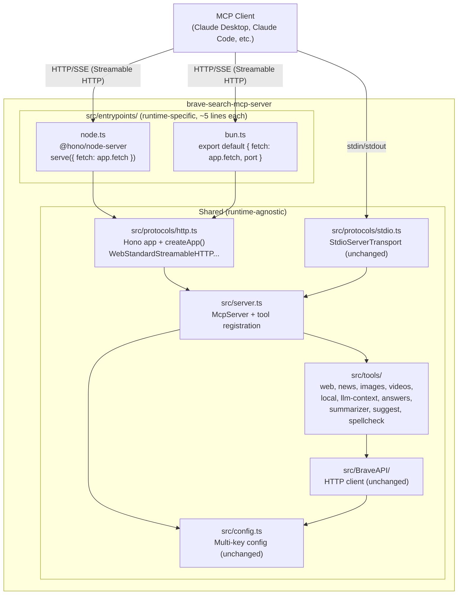
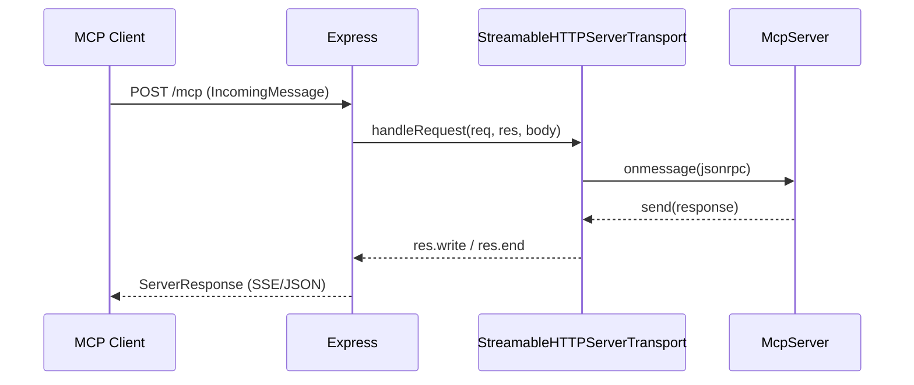
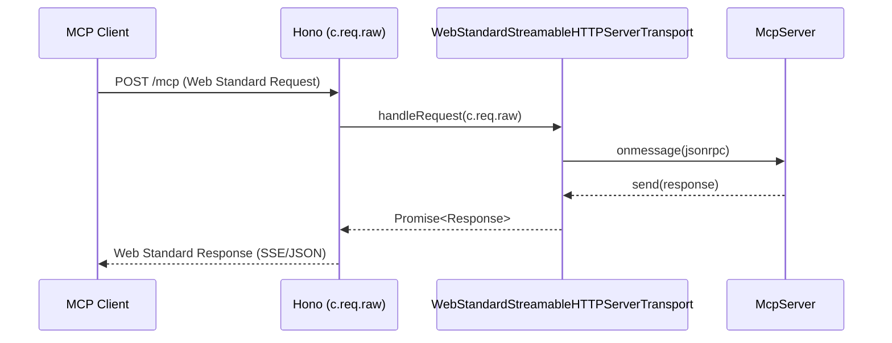
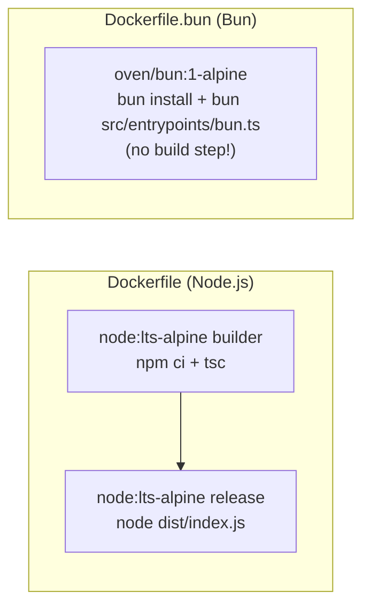

# Dual-Runtime Architecture Specification

**Version:** 1.0  
**Status:** Approved  
**Scope:** `brave-search-mcp-server`  
**Audience:** Project owners, software architects, software developers

---

## 1. Problem Statement

The current MCP server is bound to **Node.js only**. It uses:

- `express` as the HTTP framework — Node.js-specific (uses `IncomingMessage` / `ServerResponse`)
- `StreamableHTTPServerTransport` from `@modelcontextprotocol/sdk` — wraps Express `req`/`res` objects, Node.js only

This prevents running the server on **Bun**, which is measurably faster (≈2.5× HTTP throughput, ≈4.8× faster startup) and is now owned by **Anthropic** — the same company that created the MCP protocol.

**Goal:** Support both Node.js and Bun runtimes from a single codebase, with Bun using its native APIs for maximum performance, while sharing all business logic (MCP tools, config, BraveAPI client, transport session management).

---

## 2. Proposed Solution

Replace the Express-based HTTP layer with **Hono**, a Web Standards-based framework that runs identically on both Node.js (via `@hono/node-server`) and Bun (natively, via `export default { fetch }`).

Replace `StreamableHTTPServerTransport` with **`WebStandardStreamableHTTPServerTransport`**, which uses `Request`/`Response`/`ReadableStream` — the Web Standard APIs that both Hono and Bun natively implement.

The MCP SDK already ships an official Hono example using this exact pattern (see `node_modules/@modelcontextprotocol/sdk/dist/esm/examples/server/honoWebStandardStreamableHttp.js`).

---

## 3. Architecture Overview



---

## 4. Transport Layer Design

### 4.1 Current (Node.js only)



`StreamableHTTPServerTransport` is tightly coupled to Express's `req`/`res` objects.

### 4.2 New (Node.js + Bun via Web Standards)



`WebStandardStreamableHTTPServerTransport.handleRequest()` takes a `Request` and returns a `Response` — the universal Web Standard contract.

### 4.3 Transport API Comparison

| Concern | `StreamableHTTPServerTransport` | `WebStandardStreamableHTTPServerTransport` |
|---|---|---|
| Input type | Express `Request` (`IncomingMessage`) | Web Standard `Request` |
| Output type | Express `Response` (via `res.write`) | `Promise<Response>` |
| SSE streaming | Via Express chunked write | Via `ReadableStream` |
| Runtime support | Node.js only | Node.js 18+, Bun, Cloudflare Workers, Deno |
| Session state | `new Map<string, Transport>()` | Same pattern |
| Stateless mode | `sessionIdGenerator: undefined` | Same |
| CORS | Express middleware | `hono/cors` middleware |

---

## 5. Directory Structure

### 5.1 Before

```
src/
  index.ts                    ← CLI entry (commander), starts stdio or HTTP
  config.ts                   ← Multi-key config
  server.ts                   ← McpServer factory
  protocols/
    http.ts                   ← Express + StreamableHTTPServerTransport
    stdio.ts                  ← StdioServerTransport
    index.ts                  ← re-exports
  tools/                      ← 10 tools (unchanged)
  BraveAPI/                   ← HTTP client (unchanged)
```

### 5.2 After

```
src/
  index.ts                    ← Auto-detects runtime → delegates to entrypoint
  config.ts                   ← Multi-key config (unchanged)
  server.ts                   ← McpServer factory (unchanged)
  entrypoints/
    node.ts                   ← 5 lines: @hono/node-server serve()
    bun.ts                    ← 5 lines: export default { fetch, port }
  protocols/
    http.ts                   ← Hono + WebStandardStreamableHTTPServerTransport ← CHANGED
    stdio.ts                  ← StdioServerTransport (unchanged)
    index.ts                  ← re-exports (unchanged)
  tools/                      ← 10 tools (unchanged)
  BraveAPI/                   ← HTTP client (unchanged)
```

The diff is minimal: one file changed (`protocols/http.ts`), one file updated (`index.ts`), two files added (`entrypoints/node.ts`, `entrypoints/bun.ts`).

---

## 6. Runtime Auto-Detection

`src/index.ts` detects the runtime at startup and delegates:

```typescript
// Bun exposes globalThis.Bun; Node.js does not
if (typeof Bun !== 'undefined') {
  // Bun: import entrypoint — Bun picks up `export default { fetch, port }`
  await import('./entrypoints/bun.js');
} else {
  // Node.js: starts @hono/node-server
  await import('./entrypoints/node.js');
}
```

For **stdio transport**, the existing `stdioServer.start()` path is unchanged — it works on both runtimes.

---

## 7. Hono on Node.js vs Bun

### 7.1 Node.js entrypoint

```typescript
// src/entrypoints/node.ts
import { serve } from '@hono/node-server';
import { createApp } from '../protocols/http.js';
import config from '../config.js';

const app = createApp();
serve(
  { fetch: app.fetch, port: config.port, hostname: config.host },
  () => console.log(`[Node.js] http://${config.host}:${config.port}/mcp`)
);
```

`@hono/node-server` bridges `IncomingMessage`/`ServerResponse` → Web Standard `Request`/`Response` internally. The Hono app never sees Node.js-specific types.

### 7.2 Bun entrypoint

```typescript
// src/entrypoints/bun.ts
import { createApp } from '../protocols/http.js';
import config from '../config.js';

const app = createApp();
console.log(`[Bun] http://${config.host}:${config.port}/mcp`);

export default {
  port: config.port,
  hostname: config.host,
  fetch: app.fetch,
};
```

Bun picks up `export default { fetch }` natively via `Bun.serve()`. No adapter needed.

### 7.3 Shared Hono app (`src/protocols/http.ts`)

```typescript
// src/protocols/http.ts
import { Hono } from 'hono';
import { cors } from 'hono/cors';
import { WebStandardStreamableHTTPServerTransport } from
  '@modelcontextprotocol/sdk/server/webStandardStreamableHttp.js';
import { randomUUID } from 'crypto'; // Node-compat in Bun
import createMcpServer from '../server.js';
import config from '../config.js';

const transports = new Map<string, WebStandardStreamableHTTPServerTransport>();

export const createApp = () => {
  const app = new Hono();

  app.use('*', cors({
    origin: '*',
    allowMethods: ['GET', 'POST', 'DELETE', 'OPTIONS'],
    allowHeaders: ['Content-Type', 'mcp-session-id', 'Last-Event-ID', 'mcp-protocol-version'],
    exposeHeaders: ['mcp-session-id', 'mcp-protocol-version'],
  }));

  app.all('/mcp', async (c) => {
    const req = c.req.raw; // Web Standard Request
    const sessionId = req.headers.get('mcp-session-id') ?? undefined;

    let transport: WebStandardStreamableHTTPServerTransport;

    if (sessionId && transports.has(sessionId)) {
      transport = transports.get(sessionId)!;
    } else if (config.stateless) {
      transport = new WebStandardStreamableHTTPServerTransport({ sessionIdGenerator: undefined });
      await createMcpServer().connect(transport);
    } else {
      transport = new WebStandardStreamableHTTPServerTransport({
        sessionIdGenerator: () => randomUUID(),
        onsessioninitialized: (id) => transports.set(id, transport),
        onsessionclosed:      (id) => transports.delete(id),
      });
      await createMcpServer().connect(transport);
    }

    return transport.handleRequest(req); // returns Web Standard Response
  });

  app.get('/ping', (c) => c.json({ message: 'pong' }));

  return app;
};

export const start = () => {
  if (!config.ready) {
    console.error('Invalid configuration');
    process.exit(1);
  }
  // The actual server.listen() is done by the entrypoint (node.ts or bun.ts).
  // This function exists only for backwards compatibility with protocols/index.ts.
  return createApp();
};

export default { start, createApp };
```

---

## 8. Dependency Changes

### 8.1 Remove

```
express              ^5.2.1   (Node.js-specific HTTP framework)
@types/express       ^5.0.6   (types for express)
```

### 8.2 Add

```
hono                 ^4.x.x   (Web Standards HTTP framework, zero-dependency)
@hono/node-server    ^1.x.x   (thin Node.js adapter for Hono)
```

No other dependency changes. `vitest`, `typescript`, `prettier`, `shx`, `tsx`, `zod`, `commander`, `dotenv`, `@modelcontextprotocol/sdk` all remain unchanged.

---

## 9. Docker Strategy

Two Dockerfiles, one for each runtime. Both are kept in the repo for benchmarking.

### 9.1 `Dockerfile` (Node.js — current, minimal update)

- Base: `node:lts-alpine`
- Build: `npm ci && tsc`
- Run: `node dist/index.js`
- Entry: `src/entrypoints/node.ts` (compiled to `dist/entrypoints/node.js`)

### 9.2 `Dockerfile.bun` (Bun — new)

- Base: `oven/bun:1-alpine`
- Build: `bun install --frozen-lockfile --production` (no `tsc` step!)
- Run: `bun src/entrypoints/bun.ts`
- No compiled output needed — Bun runs TypeScript natively



**Bun Docker image is single-stage** because there's no compilation step — Bun runs TypeScript directly.

### 9.3 `docker-compose.yml` — Benchmark services

```yaml
# docker-compose.benchmark.yml
services:
  mcp-node:
    build:
      context: .
      dockerfile: Dockerfile
    ports: ["3001:8080"]
    environment: [BRAVE_API_KEY, BRAVE_MCP_TRANSPORT=http]

  mcp-bun:
    build:
      context: .
      dockerfile: Dockerfile.bun
    ports: ["3002:8080"]
    environment: [BRAVE_API_KEY, BRAVE_MCP_TRANSPORT=http]
```

---

## 10. Benchmarking

### 10.1 Ping endpoint (HTTP throughput)

```bash
# Start both servers
task bench:start:node   # runs on localhost:3001
task bench:start:bun    # runs on localhost:3002

# Benchmark with autocannon (install: npm i -g autocannon)
autocannon -c 50 -d 30 http://localhost:3001/ping   # Node.js
autocannon -c 50 -d 30 http://localhost:3002/ping   # Bun
```

### 10.2 MCP initialize request (startup latency)

```bash
# Measure time for MCP client to initialize a session
task bench:mcp:node
task bench:mcp:bun
```

### 10.3 Expected results (based on Bun benchmarks)

| Metric | Node.js | Bun | Expected gain |
|---|---|---|---|
| HTTP req/s (ping) | ~30k | ~75k | ~2.5× |
| Process startup | ~250ms | ~50ms | ~4.8× |
| `Response.json()` | baseline | 3.5× | faster JSON |
| SSE streaming | baseline | slightly faster | native async gen |

---

## 11. npm Scripts

New scripts added to `package.json`:

```json
{
  "scripts": {
    "start": "node dist/index.js",
    "start:node": "node dist/entrypoints/node.js --transport http",
    "start:bun": "bun src/entrypoints/bun.ts",
    "dev:node": "tsx src/entrypoints/node.ts --transport http",
    "dev:bun": "bun --hot src/entrypoints/bun.ts",
    "bench:node": "autocannon -c 50 -d 30 http://localhost:3001/ping",
    "bench:bun": "autocannon -c 50 -d 30 http://localhost:3002/ping"
  }
}
```

---

## 12. Backwards Compatibility

| Feature | Before | After | Compatible? |
|---|---|---|---|
| `--transport stdio` | `stdioServer.start()` | unchanged | ✅ |
| `--transport http` | Express on port | Hono on same port | ✅ |
| `BRAVE_MCP_PORT`, `BRAVE_MCP_HOST` | respected | respected | ✅ |
| `--stateless` flag | supported | supported | ✅ |
| MCP session IDs | `Map<string, StreamableHTTPServerTransport>` | `Map<string, WebStandardStreamableHTTPServerTransport>` | ✅ |
| Smithery config | `configSchema` + `setOptions()` | unchanged | ✅ |
| All 10 MCP tools | unchanged | unchanged | ✅ |
| Unit tests (vitest) | pass | pass (vitest works on both runtimes) | ✅ |
| e2e tests (HTTP) | pass | pass (same endpoints, same protocol) | ✅ |
| Docker `ENTRYPOINT` | `node dist/index.js` | `node dist/index.js` (unchanged) | ✅ |

---

## 13. Implementation Checklist

- [ ] Create `src/entrypoints/node.ts`
- [ ] Create `src/entrypoints/bun.ts`
- [ ] Refactor `src/protocols/http.ts` (Express → Hono + WebStandardTransport)
- [ ] Update `src/index.ts` (runtime autodetect)
- [ ] `npm install hono @hono/node-server`
- [ ] `npm uninstall express @types/express`
- [ ] Update `package.json` scripts
- [ ] Add `Dockerfile.bun`
- [ ] Update `docker-compose.yml` (add bun service)
- [ ] Add `docker-compose.benchmark.yml`
- [ ] Update `Taskfile.yml` (add Bun + benchmark tasks)
- [ ] Run `npm run build` — verify TypeScript compiles
- [ ] Run `npm test` — verify all unit tests pass
- [ ] Run `npm run test:e2e:http` — verify HTTP e2e tests pass
- [ ] Run `bun src/entrypoints/bun.ts` — verify Bun starts correctly
- [ ] Update `README.md` — document dual runtime support
