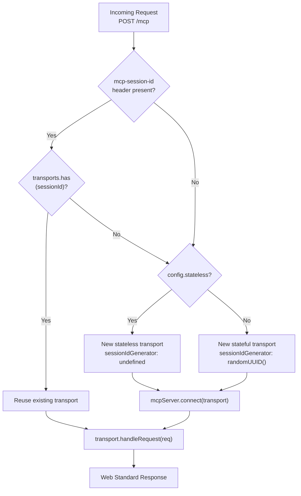
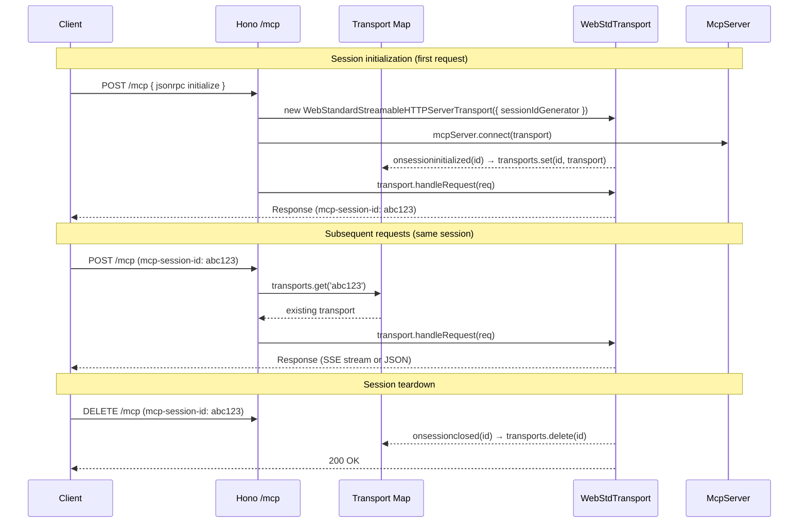

# Transport Layer Specification

**Version:** 1.0  
**Status:** Approved  
**Scope:** `src/protocols/http.ts` and `src/entrypoints/`

---

## Overview

The MCP Streamable HTTP transport layer handles all HTTP-based communication between MCP clients and the server. This document specifies the transport implementation using `WebStandardStreamableHTTPServerTransport` and Hono.

---

## Session Management

The server supports two session modes, controlled by `config.stateless`:



### Session lifecycle



---

## CORS Configuration

All HTTP responses include CORS headers via `hono/cors`:

| Header | Value |
|--------|-------|
| `Access-Control-Allow-Origin` | `*` |
| `Access-Control-Allow-Methods` | `GET, POST, DELETE, OPTIONS` |
| `Access-Control-Allow-Headers` | `Content-Type, mcp-session-id, Last-Event-ID, mcp-protocol-version` |
| `Access-Control-Expose-Headers` | `mcp-session-id, mcp-protocol-version` |

---

## Endpoints

| Path | Methods | Purpose |
|------|---------|---------|
| `/mcp` | `GET, POST, DELETE` | MCP Streamable HTTP transport |
| `/ping` | `GET` | Health check / benchmarking |

### `/mcp` — MCP Streamable HTTP

- `POST` — Send JSON-RPC message(s); may return SSE stream or JSON response
- `GET` — Establish standalone SSE stream for server-initiated notifications  
- `DELETE` — Terminate session (stateful mode only)

### `/ping` — Health check

Returns `{ "message": "pong" }` with status `200`. Used for benchmarking and liveness probes.

---

## Error Handling

| Condition | Response |
|-----------|----------|
| Invalid session ID | `404 Not Found` (handled by transport) |
| Missing session ID (non-init) | `400 Bad Request` (handled by transport) |
| Unsupported method (PUT, PATCH) | `405 Method Not Allowed` (handled by transport) |
| Internal error | `500 Internal Server Error` (JSON-RPC error envelope) |

---

## Stateless Mode

In stateless mode (`--stateless` or `BRAVE_MCP_STATELESS=true`), every request creates a fresh transport and MCP server instance with no session ID. This is suitable for serverless environments and load-balanced deployments where sticky sessions are not available.

```
POST /mcp → new transport (no session ID) → new McpServer → handle → response
POST /mcp → new transport (no session ID) → new McpServer → handle → response
```

---

## Runtime Behaviour Differences

| Concern | Node.js (`@hono/node-server`) | Bun (native) |
|---------|-------------------------------|--------------|
| HTTP server | `node:http` wrapped by `@hono/node-server` | `Bun.serve()` internally |
| SSE delivery | Via `TransformStream` / `ReadableStream` | Via `ReadableStream` (faster) |
| `crypto.randomUUID()` | Node.js `crypto` module | Bun `crypto` compat layer |
| JSON parsing | `JSON.parse()` | `JSON.parse()` (3.5× faster in Bun) |
| Connection handling | Node.js event emitter | Bun native I/O |

The Hono app and transport code is **identical** on both runtimes. Only the server bootstrap differs (5-line entrypoints).
